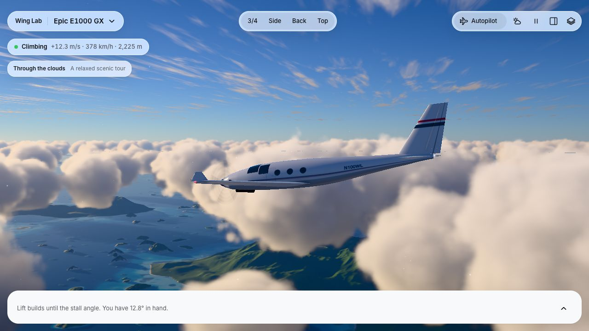
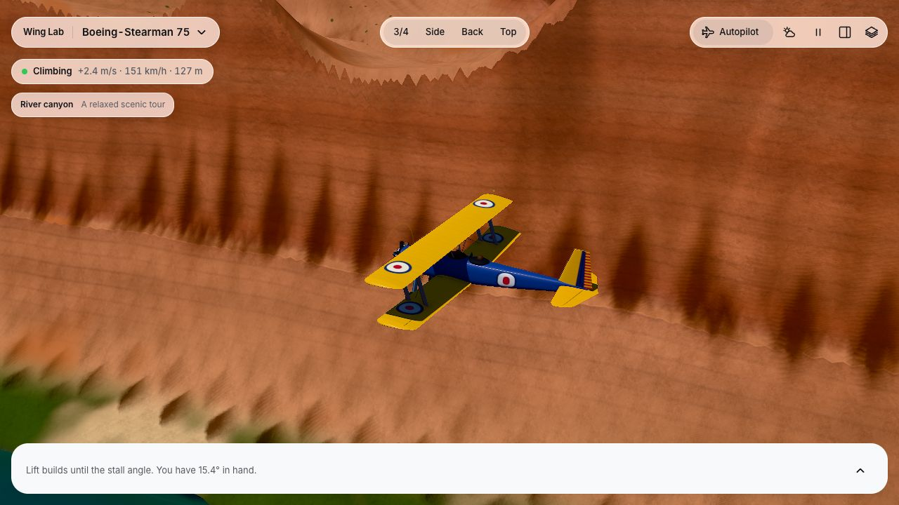
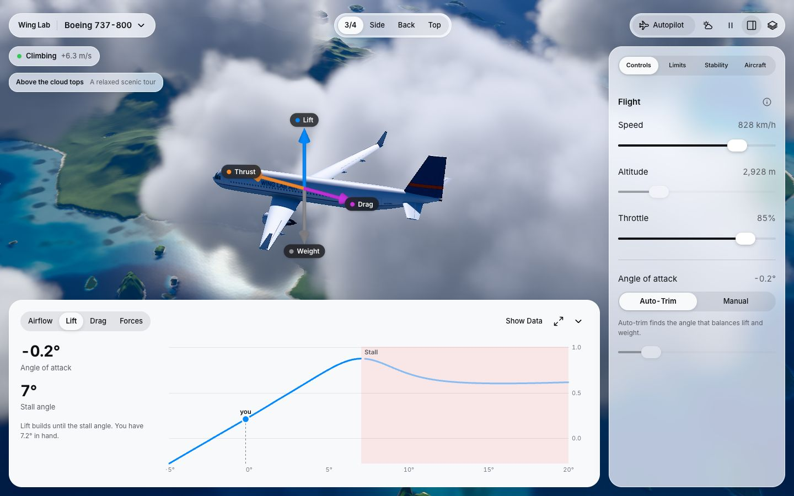

# ✈ Wing Lab

**Take the controls. Chase the clouds. Discover what makes a plane fly.**

Fly over tropical islands and through a river canyon, then experiment with the science keeping you in the sky.

## [Play Wing Lab →](https://romanatbrief.github.io/WingLab/)

Free to explore in your browser. No download or account needed.

## Your flight, your experiment

- **Pick your aircraft.** Try seven different designs, from a Stearman biplane and Spitfire to a glider, Boeing 737 and Concorde.
- **Explore two worlds.** Cruise above the Philippine islands or follow the Grand Canyon’s river. Try morning, midday and golden-hour lighting.
- **Find out why it flies.** Change wing shape, size or angle. Watch the model, force arrows and live charts respond—and see what happens as a wing approaches a stall.

## Take the controls

Let **Autopilot** take you on a scenic tour, or switch to **Manual** and fly your own route. A small guide appears on screen.

| Keys | What happens |
| --- | --- |
| ← / → | Bank and turn |
| ↑ / ↓ | Climb and dive |
| W / S | Increase / decrease throttle |
| P | Switch Autopilot / Manual |
| 3 | Look from behind the aircraft |

Release the arrows to ease back into level flight. Drag to orbit the camera; scroll to zoom. On iPhone or iPad, use the touch arrows or choose **Manual → Enable tilt** and hold your device comfortably. Tap **Recenter** whenever you want a new level position.

Want to investigate? Open **More → Flight controls** or **Analysis charts** on your phone. Panels and 3D force arrows start hidden; turn the arrows on in **Overlays**.

## Try this: become a wing detective

Choose a glider, then compare it with Concorde. What changes when the wings become long and narrow, or short and swept? Make a prediction, change one thing, and check the lift and drag charts.

*All screenshots above were captured directly from the running app.*

[For builders: development guide](docs/DEVELOPMENT.md) · [Asset credits](assets/ATTRIBUTION.md)

---

**About this experiment:** Wing Lab was built using **GPT 6.0 Astra** as an experiment in AI-assisted app creation. It is an educational playground: aircraft, landscapes and flight behaviour are simplified, and bugs or inaccuracies may remain. It is not intended for real-world flight training or navigation.
